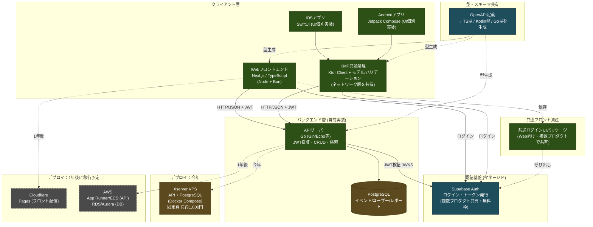

# NatuIveについて
## 読み方：なちゅいべ

## プロダクトビジョン
生態系を守り、未来へ繋ぐ

## なちゅいべ概要
メイン目的：

生物のイベントを一元管理するサイト。生物のイベントが集まる場所。
生物のイベントを推進することで、保全活動を支援する。
関心を上げ、イベント参加のハードルを下げる。
サブ目的：イベントの結果を収集し、分析に役立てる。
目的外： 外来種対策

# 想定デバイス

- Web

- モバイル
    - Android
    - iPhone
- タブレット
    - Android
    - iPad

# 構成図（初期時点）

